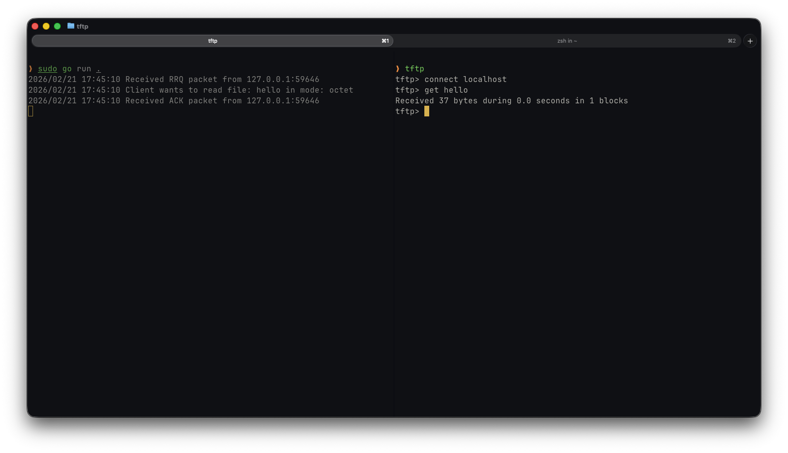

# From UDP to TFTP: RFC 1350 Implementation

A native Go implementation of the Trivial File Transfer Protocol (TFTP), specifically focusing on
the [RFC 1350](https://datatracker.ietf.org/doc/html/rfc1350).

# How I implemented it?

## Step 1 ~ Let's Start

I have implemented the code to create a UDP connection on port 69 (default port for TFTP)
to be able to read data (packet) from the connection with a buffer size of 516 bytes.
The buffer size is set to 516 bytes to accommodate the maximum standard TFTP DATA packet (4 bytes for the header + 512
bytes of payload):

```
2 bytes    2 bytes      up to 512 bytes
------------------------------------------
| 03    |   Block #  |        Data       |
------------------------------------------
```

## Step 2 ~ My first successful TFTP connection

The goal is parse the first 2 bytes (the Op.Code) of the packet.
The operation code represent which operation the packet wants to do and the format.
The server must be able to support all 5 op. code defined in the RFC 1350.

Each op. code is represented in the code as a constant of type `OpCode`.
The `OpCode` is defined as a `uint16` to match the 2-byte field specified in the RFC.
I had used the `OpCode` constant in a switch so we can decide how to treat each packet.

```
switch extractTheOpCode(rawPacket[:n]) {
case OpRRQ:
    log.Printf("Received RRQ packet from %s\n", clientAddr)
case OpWRQ:
    log.Printf("Received WRQ packet from %s\n", clientAddr)
default:
    log.Printf("Unknow or unsupported op.code!")
}
```

After reviewing what I was done until now, I realize that probably I should create struct to hold the packet
information. Each packet type has a unique structure and specific logic requirements.
I started by implementing the `RRQ` (Read Request) struct:

```
type RRQ struct {
	Filename string
	Mode     string
}
```

Associated with this function I had create a `ParseRRQ(b []byte) (*RRQ, error)` that take a raw byte slice and extract
an RRQ struct. Once that was in place, I write the server function
`HandleRRQ(conn *net.UDPConn, addr *net.UDPAddr, rrq *RRQ)` that effectively handles the RRQ request by sending data.
After putting all together this how it looks my case of RRQ:

```
case OpRRQ:
    log.Printf("Received RRQ packet from %s\n", clientAddr)
    rrq, err := ParseRRQ(rawPacket[:n])
    if err != nil {
        log.Printf("Malformed RRQ request from %s, error: %v\n", clientAddr, err)
        continue
    }

    s.HandleRRQ(conn, clientAddr, rrq)
```

Now I was ready to send the first few bytes! I implement the `DATA` struct and the `(pd DATA) Marshal() ([]byte, error)`
function that create a ready to send, byte slice (packet) from the `DATA` struct. After marshaling a hard code `DATA`
struct I have sent the first few bytes through the TFTP protocol!!

```
func (s UdpServer) HandleRRQ(conn *net.UDPConn, addr *net.UDPAddr, rrq *RRQ) {
	log.Printf("Client wants to read file: %s in mode: %s\n", rrq.Filename, rrq.Mode)

	bytes, _ := DATA{
		BlockId: 1,
		Payload: []byte("Hello! This is my first TFTP packet.\n"),
	}.Marshal()

	_, _ = conn.WriteToUDP(bytes, addr)
}
```



## Step 3 ~ Go routines

The issue: UDP is stateless, so the server must keep track of the current state for each connection.
`TFTP` offers a solution to this problem: it listens for every request on port `69` and hands the client off to a new
ephemeral port. With this solution, I can take advantage of goroutines. After the initial request on port `69`, I can
hand
off the request to a dedicated worker.

I have refactored the function `HandleRRQ(addr *net.UDPAddr, rrq *RRQ)` to receive only the client address and the RRQ
packet as arguments. The function immediately creates a new UDP socket with an ephemeral port. All communication will go
through it. The function starts by sending a `DATA` packet with the first 512 bytes and waits for an `ACK`. The `ACK`
must be received within 3 seconds; otherwise, the function times out and sends the same block again. The function will
try to send the same block 3 times before giving up and closing the connection. If the `ACK` is received correctly, the
function sends the next block. This cycle repeats until the final block (less than 512 bytes) is sent correctly.

## Project Status

- [x] UDP Server on Port 69
- [x] RRQ (Read Request) Parsing
- [x] DATA Packet Marshaling
- [x] Open a new UDP socket (ephemeral port) to transfer file.
- [x] ACK (Acknowledgment) Handling
- [ ] Read and send a file on the file system.
